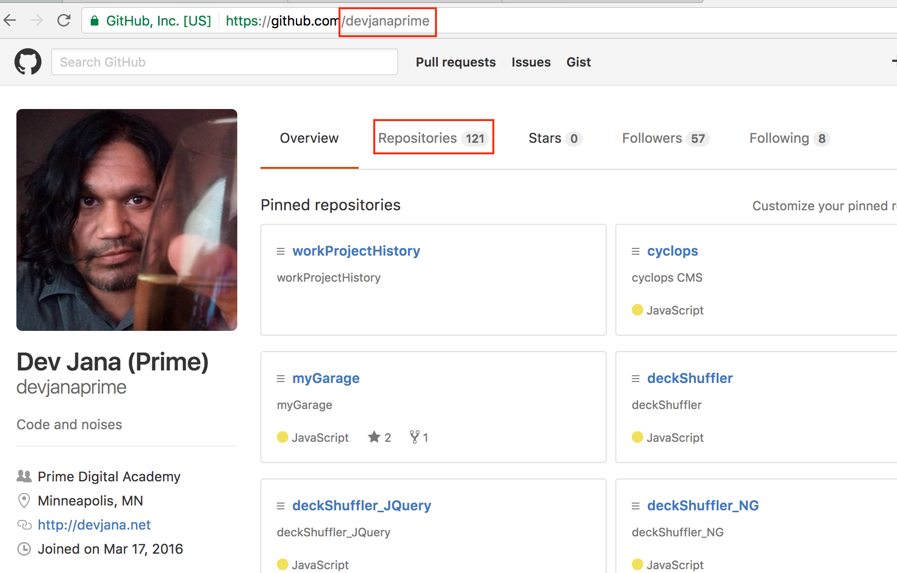
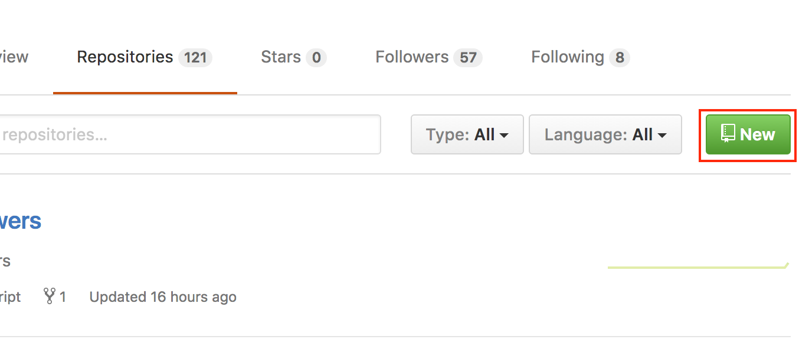
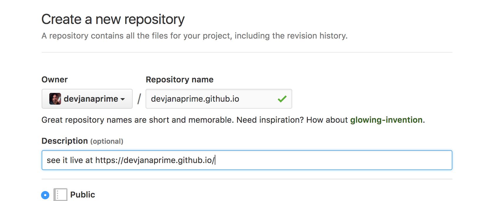

HTML CSS Workshop
=================
[Prime Digital Academy](https://primeacademy.io)
, [@devjana](https://twitter.com/devjana), 12-14-2016

Overview:
---------
* welcome/intro
* how does the Internet work? (@ a high level)
* HTML basics
* group activity
* CSS basics

Tools:
------
* github
* github pages
* your mind

Setup:
------
* You should already have a [github](https://github.com) account
* take note of your github username
* we're going to create a new github repositry (repo)
* click on 'Repositories'

* click on 'new'

* name the new repo YOURUSERNAME.github.io

HTML Basics:
------------
* html
* head
* body
* paragraph
* div 
* headers (h1-h6) 
* lists: unordered, ordered, list items
* img

CSS Basics:
-----------
* color
* background-color
* font family
* width
* padding
* border

Next Steps:
-----------
* keep exploring
* add features/content
* communicate with your peers

Resources:
----------
* [codecademy](https://codecademy.com)
* [lynda.com](https://lynda.com)
* [w3schools.com](http://www.w3schools.com)